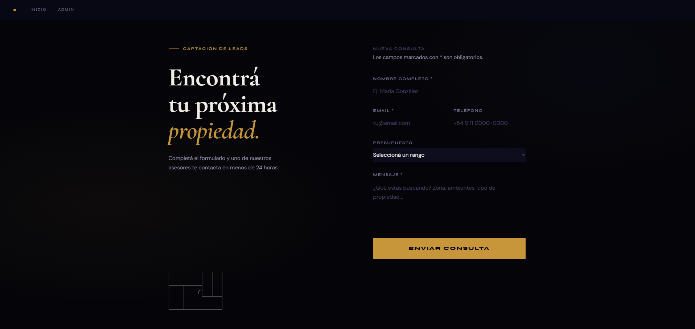
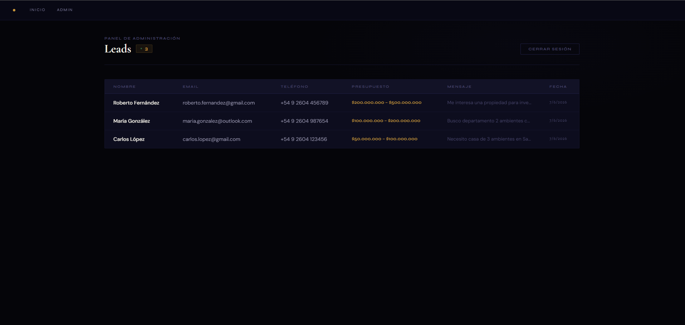

# lead-capture-firebase

Sistema de captación de leads inmobiliarios construido con Firebase Auth + Firestore + FastAPI + React.

Los leads enviados desde el formulario público se guardan en Firestore via FastAPI. El panel de administración muestra los leads en tiempo real con `onSnapshot` y requiere autenticación con Firebase Auth.

## Screenshots

| Formulario público | Panel admin |
|---|---|
|  |  |

## Stack

| Capa | Tecnología |
|---|---|
| Frontend | React 18 + Vite |
| Autenticación | Firebase Auth (email/password) |
| Base de datos | Firestore (tiempo real con `onSnapshot`) |
| Backend | FastAPI + Python 3.10+ |
| Firebase server | firebase-admin SDK |

## Arquitectura del flujo

```
[Formulario público]
        │
        │  POST /leads  (JSON: nombre, email, teléfono, presupuesto, mensaje)
        ▼
[FastAPI backend]
        │
        │  firestore.collection("leads").add(...)
        ▼
[Firestore]
        │
        │  onSnapshot  (escucha cambios en tiempo real)
        ▼
[Panel admin]  ← protegido por Firebase Auth
```

El backend valida el payload con Pydantic y añade `createdAt: SERVER_TIMESTAMP` antes de escribir. El panel admin verifica el token Firebase ID en cada request a `GET /leads`.

## Requisitos

- Node.js 18+
- Python 3.10+
- Cuenta Firebase con un proyecto creado (Firestore en modo nativo, Authentication con proveedor Email/Password habilitado)
- Service Account Key descargada desde Firebase Console → Configuración del proyecto → Cuentas de servicio

## Instalación y ejecución local

### 1. Clonar el repositorio

```bash
git clone https://github.com/nachixxs/lead-capture-firebase.git
cd lead-capture-firebase
```

### 2. Backend (FastAPI)

```bash
cd backend

# Crear y activar entorno virtual
python -m venv venv
venv\Scripts\activate          # Windows
# source venv/bin/activate     # macOS/Linux

# Instalar dependencias
pip install -r requirements.txt

# Configurar variables de entorno
cp .env.example .env
# Editar .env con tus valores

# Colocar serviceAccountKey.json en esta carpeta
# (descargar desde Firebase Console → Configuración → Cuentas de servicio)

# Correr el servidor
uvicorn main:app --reload
# Disponible en http://localhost:8000
```

### 3. Frontend (React + Vite)

```bash
cd frontend

# Instalar dependencias
npm install

# Configurar variables de entorno
cp .env.example .env
# Editar .env con los datos de tu proyecto Firebase

# Correr el servidor de desarrollo
npm run dev
# Disponible en http://localhost:5173
```

## Variables de entorno

### Backend — `backend/.env`

| Variable | Descripción |
|---|---|
| `ALLOWED_ORIGINS` | Origen(es) permitidos para CORS. En producción: `https://tu-dominio.com`. En desarrollo se permite automáticamente `http://localhost:*`. |
| `FIREBASE_PROJECT_ID` | ID del proyecto Firebase (ej: `mi-proyecto-12345`). |

> El backend también requiere el archivo `serviceAccountKey.json` en la carpeta `backend/`. Este archivo **nunca** debe commitearse — está en `.gitignore`.

### Frontend — `frontend/.env`

| Variable | Descripción |
|---|---|
| `VITE_BACKEND_URL` | URL base del backend. En producción: `https://tu-api.railway.app`. En desarrollo se usa `http://localhost:8000` por defecto. |
| `VITE_FIREBASE_API_KEY` | API Key del proyecto Firebase. |
| `VITE_FIREBASE_AUTH_DOMAIN` | Auth domain (ej: `mi-proyecto.firebaseapp.com`). |
| `VITE_FIREBASE_PROJECT_ID` | ID del proyecto Firebase. |
| `VITE_FIREBASE_STORAGE_BUCKET` | Storage bucket (ej: `mi-proyecto.appspot.com`). |
| `VITE_FIREBASE_MESSAGING_SENDER_ID` | Sender ID para Firebase Cloud Messaging. |
| `VITE_FIREBASE_APP_ID` | App ID del proyecto Firebase. |

Todos estos valores se obtienen en Firebase Console → Configuración del proyecto → Tus apps → SDK de la app web.

## Endpoints de la API

| Método | Ruta | Auth | Descripción |
|---|---|---|---|
| `GET` | `/` | No | Health check |
| `POST` | `/leads` | No | Guarda un nuevo lead en Firestore |
| `GET` | `/leads` | Firebase ID Token | Devuelve todos los leads ordenados por fecha |

## Deploy

- **Frontend:** Vercel (conectar repo, configurar las `VITE_*` como variables de entorno en el proyecto).
- **Backend:** Railway o Render (configurar `ALLOWED_ORIGINS` y subir `serviceAccountKey.json` como secret/variable de archivo).
