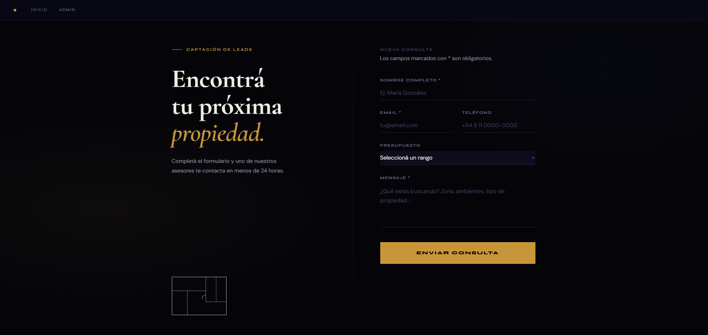

# lead-capture-firebase

A lead capture app for real estate: a public inquiry form that stores leads in
Firestore through a FastAPI backend, and a login-protected admin panel that
shows new leads in real time.



## What it does

- **Public form**: name, email, phone, budget range and message. Submitted to
  `POST /leads` on the backend, which validates it and writes it to Firestore.
- **Admin panel** at `/admin`: sign-in with Firebase Auth (email/password), then a
  table of leads, newest first, that updates live through a Firestore `onSnapshot`
  subscription.
- **Protected read endpoint**: `GET /leads` returns all leads only with a valid
  Firebase ID token (`Authorization: Bearer <token>`). The current admin panel
  reads Firestore directly and does not call it.

## Tech stack

| Layer | Technology |
|---|---|
| Frontend | React 19, Vite, React Router |
| Auth | Firebase Authentication (email/password) |
| Database | Cloud Firestore |
| Backend | Python, FastAPI, Pydantic, `firebase-admin` |

## How it works

```
[Public form] ──POST /leads──▶ [FastAPI + firebase-admin] ──write──▶ [Firestore "leads"]
                                                                          │
[Admin panel] ◀──────────── onSnapshot (live) ────────────────────────────┘
      ▲
      └── Firebase Auth sign-in
```

- The backend validates the payload with a Pydantic model (`EmailStr` for the
  email; name, email and message required) and adds a `createdAt` server timestamp
  before writing, so ordering doesn't depend on the client's clock.
- Writes go through the backend with the Admin SDK; the admin panel reads with
  the Firebase client SDK after sign-in.
- CORS origins come from `ALLOWED_ORIGINS` (comma-separated). When it's unset,
  only `http://localhost:<any port>` is allowed, for local development.

## API

| Method | Path | Auth | Description |
|---|---|---|---|
| `GET` | `/` | none | Health check |
| `POST` | `/leads` | none | Validates and stores a lead, returns `201` with its id |
| `GET` | `/leads` | Firebase ID token | Returns all leads, newest first |

## Getting started

Requirements: Node.js, Python 3.10+, and a Firebase project with Firestore and
the Email/Password sign-in provider enabled.

**Backend**

```bash
cd backend
python -m venv venv
venv\Scripts\activate            # Windows; on macOS/Linux: source venv/bin/activate
pip install -r requirements.txt
cp .env.example .env             # ALLOWED_ORIGINS is optional in development
uvicorn main:app --reload        # http://localhost:8000
```

The backend also needs a Firebase service account key saved as
`backend/serviceAccountKey.json` (Firebase Console → Project settings → Service
accounts). It is git-ignored and loaded by relative path, so run `uvicorn` from
`backend/`.

**Frontend**

```bash
cd frontend
npm install
npm run dev                      # http://localhost:5173
```

Create `frontend/.env` with your Firebase web app config (Firebase Console →
Project settings → Your apps):

```
VITE_FIREBASE_API_KEY=
VITE_FIREBASE_AUTH_DOMAIN=
VITE_FIREBASE_PROJECT_ID=
VITE_FIREBASE_STORAGE_BUCKET=
VITE_FIREBASE_MESSAGING_SENDER_ID=
VITE_FIREBASE_APP_ID=
VITE_BACKEND_URL=                # optional, defaults to http://localhost:8000
```

Create the admin user in Firebase Console → Authentication.

## Verification

There are no automated tests yet. `npm run lint` and `npm run build` pass in
`frontend/`.

## Project status

Small portfolio project; no live demo is linked. Things to know before deploying:

- The admin panel reads Firestore from the browser, so who can read the `leads`
  collection is decided by Firestore security rules. Those rules live in the
  Firebase project and are not versioned in this repo.
- `POST /leads` is public and has no rate limiting or spam protection.
- The frontend is meant for a static host and the backend for a Python host; set
  `ALLOWED_ORIGINS` to the frontend's origin and `VITE_BACKEND_URL` to the API's
  URL.
